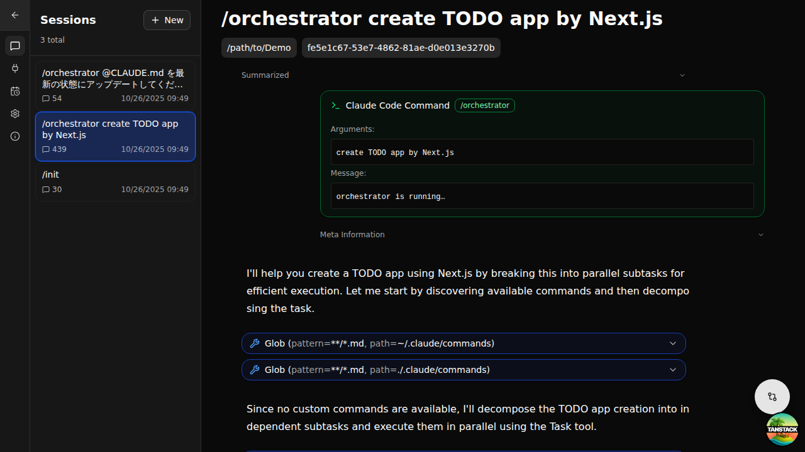
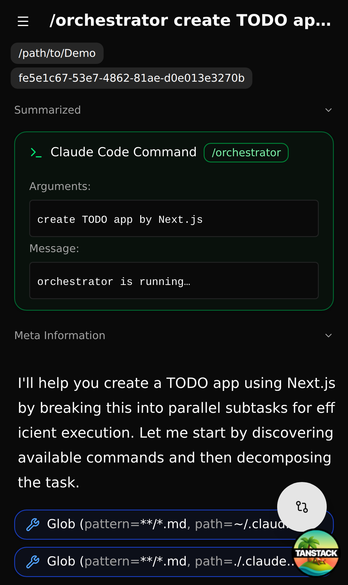

# Claude Code Viewer

[](https://github.com/d-kimuson/claude-code-viewer/blob/main/LICENSE)
[](https://github.com/d-kimuson/claude-code-viewer/actions/workflows/ci.yml)
[](https://github.com/d-kimuson/claude-code-viewer/releases)

A full-featured web-based Claude Code client that provides complete interactive functionality for managing Claude Code projects. Start new conversations, resume existing sessions, monitor running tasks in real-time, and browse your conversation history—all through a modern web interface.


## Introduction

Claude Code Viewer is a web-based Claude Code client focused on **comprehensive session log analysis**. It preserves and organizes all conversation data through strict schema validation and a progressive disclosure UI that reveals details on demand.

**Core Philosophy**: Zero data loss + Effective organization + Remote-friendly design

## Features

| Feature | Description |
| --- | --- |
| View Chat Logs | View Claude Code session logs in real-time through the web UI. Supports historical logs as it uses standard Claude Code logs (~/.claude/projects/...) as the data source |
| Start Conversations | Start Claude Code sessions directly from Claude Code Viewer. Enjoy core functionality like file/command completion, pause/resume, and tool approval through a superior web experience |
| Resume Sessions | Resume conversations directly from existing session logs |
| Continue Sessions | Claude Code Viewer provides advanced session process control. Sessions started through Claude Code Viewer remain alive (unless aborted), allowing you to continue conversations without resuming (no session-id reassignment) |
| Create Projects | Create new projects from Claude Code Viewer. Select a directory through the web UI to execute the `/init` command and begin project setup |
| Review Changes | Built-in Git Diff Viewer lets you review all changes directly within Claude Code Viewer |

## Screenshots

| Feature | Capture |
| --- | --- |
| BasicChat (Desktop) |  |
| BasicChat (Mobile) |  |
| CommandCompletion |  |
| FileCompletion |  |
| Diff Viewer |  |

Note: Additional UI screenshots are available in [/e2e/snapshots/](./e2e/snapshots/)

## Installation & Usage

### Quick Start (CLI)

Run directly from npm without installation:

```bash
PORT=3400 npx @kimuson/claude-code-viewer@latest
```

Alternatively, install globally:

```bash
npm install -g @kimuson/claude-code-viewer
claude-code-viewer
```

The server will start on port 3400 (or your specified PORT). Open `http://localhost:3400` in your browser to access the interface.

## Data Source

The application reads Claude Code conversation logs from:

- **Location**: `~/.claude/projects/<project>/<session-id>.jsonl`
- **Format**: JSONL files containing conversation entries
- **Auto-detection**: Automatically discovers new projects and sessions

## Requirements

### System Requirements

- **Node.js**: Version 20.12.0 or later
- **Operating Systems**: macOS and Linux (Windows is not supported)

### Claude Code Compatibility

- **Minimum Version**: Claude Code v1.0.50 or later
- **Tool Approval Feature**: Requires Claude Code v1.0.82 or later

**Note on Version Support**: Recent versions of Claude Code have adopted more aggressive summarization behavior. To accommodate users who prefer to pin to specific versions, Claude Code Viewer maintains compatibility with Claude Code v1.0.50 and later for the foreseeable future.

## Configuration

### Environment Variables

Claude Code Viewer reads several reserved environment variables. All values are optional and only need to be set if you want to override the defaults.

| Key | Description |
| --- | --- |
| CLAUDE_CODE_VIEWER_CC_EXECUTABLE_PATH | Path to Claude Code installation |
| PORT | Port number for Claude Code Viewer to run on |

### User Settings

Settings can be configured from the sidebar in Claude Code Viewer.

| Setting | Default | Description |
| --- | --- | --- |
| Hide sessions without user messages | true | Claude Code creates logs for operations like `/compact` that aren't tied to actual tasks, which can create noise. When enabled, sessions without user messages are hidden. |
| Unify sessions with same title | true | When resuming, Claude Code creates a new session with regenerated conversation logs. When enabled, only the latest session with the same title is displayed. |
| Enter Key Behavior | Shift+Enter | Specifies which key combination sends messages. Options include Enter, Shift+Enter, and Command+Enter. |
| Permission Mode | Ask permission | Controls the approval logic when Claude Code requests tool invocations. By default, users approve requests through the UI. This feature requires Claude Code v1.0.82 or later; earlier versions automatically approve regardless of this setting. |
| Theme | System | Toggles between Dark Mode and Light Mode. Default follows system settings. |
| Notifications | None | Enables sound notifications when running session processes complete. |


## Alternatives & Differentiation

Several excellent Claude Code web clients exist, each with their own strengths:

- https://github.com/sugyan/claude-code-webuisupport
- https://github.com/wbopan/cui
- https://github.com/siteboon/claudecodeui

**What Makes Claude Code Viewer Different**: While these tools excel as general-purpose web clients, Claude Code Viewer is specifically designed as a **session log viewer** with:

- **Zero Information Loss**: Strict Zod schema validation ensures every conversation detail is preserved
- **Progressive Disclosure**: Expandable elements and sub-session modals help manage information density
- **Built-in Git Diff Viewer**: Comprehensive branch comparison support for remote development workflows
- **Session Flow Analysis**: Complete conversation tracking across multiple sessions

Each tool serves different use cases—choose the one that best fits your workflow and priorities.

## Remote Development

Claude Code Viewer is designed with remote hosting in mind. To support remote development workflows, it includes:

- **Mobile-Optimized UI**: Responsive interface that works seamlessly on mobile devices
- **Built-in Git Viewer**: Review changes without needing local Git tools

The application features a separated client-server architecture that enables remote hosting. However, **authentication and authorization features are not included** (and are not on the roadmap). If you plan to host Claude Code Viewer remotely, carefully evaluate your security requirements and implement appropriate access controls at the infrastructure level.

## License

This project is available under the MIT License.

## Contributing

See [docs/dev.md](docs/dev.md) for detailed development setup and contribution guidelines.
